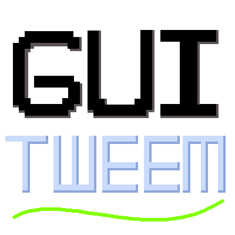

# GUI Tween

  

为 Minecraft 添加流畅、可配置的 GUI 动画效果，覆盖容器界面、快捷栏、聊天、BOSS 血条和提示框等所有界面元素。

---

## 功能介绍

### 窗口/容器界面动画
- **打开动画** — 界面从可配置的偏移位置滑入，并带有渐变淡入效果
- **关闭动画** — 关闭时反向滑出
- **按界面排除** — 可为特定界面类禁用窗口动画
- **JEI 面板动画** — JEI 左右面板随窗口独立开合
- **调试窗口** — 显示界面类名，带复制按钮

### 物品动画
- **悬停动画** — 物品在鼠标悬停时放大
- **提示框动画** — 提示框平滑淡入
- **点击动画** — 点击物品时产生顿缩/放大效果
- **输出动画** — 合成台、熔炉等输出格物品出现时带缩放或弹跳效果
- **拖拽动画** — 拖拽物品时根据速度旋转，松开后带弹簧回摆
- **同类物品抖动** — 拖拽物品与下方物品同类型时触发抖动
- **快速合成动画** — 批量合成物品带缩放动画

### 快捷栏动画
- **手持物品缩放** — 当前选中格子物品放大（可选切换过渡动画）
- **选中物品名称** — 切换格子时物品名称滑动淡入淡出
- **攻击动画** — 攻击时手持物品摆动旋转
- **使用动画** — 食用、格挡或使用物品时物品缩放脉动
- **空手动画** — 空手使用/攻击时快捷栏抖动
- **选择框动画** — 滚轮切换时选择框平滑滑动
- **经验值动画** — 经验等级变化时数字缩放
- **护甲动画** — 护甲值变化时图标放大（增加）或抖动（减少）

### 聊天动画
- **聊天打开/关闭** — 聊天界面滑动淡入/淡出
- **聊天消息** — 新消息从左侧滑入并淡入

### BOSS 血条动画
- **BOSS 出现** — 血条水平拉伸并淡入
- **BOSS 消失** — 血条收缩淡出
- **BOSS 受伤** — 血条受击抖动

### 缓动系统
所有动画支持 26 种缓动类型：
`Linear`、`Quad`（In/Out/InOut）、`Cubic`、`Quart`、`Quint`、`Sine`、`Expo`、`Circ`、`Back`、`Elastic`、`Bounce`

---

## 数据包支持

容器界面输出槽位通过 `assets/guitween/window_slots/` 下的 JSON 数据包文件定义。内置支持：工作台、熔炉、高炉、烟熏炉、锻造台、切石机、织布机、砂轮、制图台、铁砧、物品栏。

---

## 兼容性

- **JEI / REI / EMI** — 面板动画支持，条件加载对应 Mixin
- **ImmersiveUI** — 自动检测兼容
- **Sodium** — 兼容（条件 Mixin 处理）
